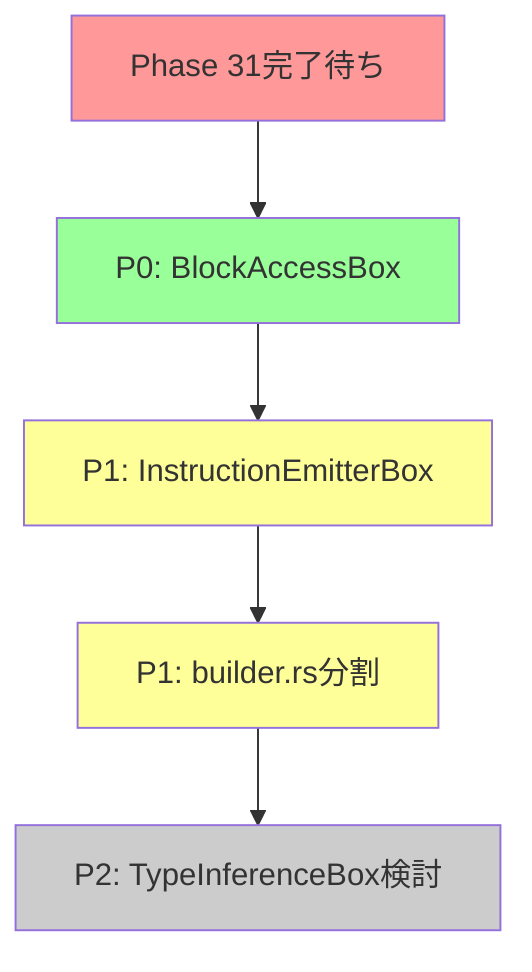

# 箱化・モジュール化候補レポート (2025-10-17)

**調査範囲**: `src/mir`, `src/backend`, `src/runtime` (770ファイル、総28,000行以上)

---

## エグゼクティブサマリー

### 🎯 **主要発見**
1. **大規模ファイル**: 500行以上のファイルが20+個存在
2. **重複パターン**: `safe_next_value()` 84箇所、`emit_instruction()` 48箇所
3. **箱化候補**: 既存の`XxxBox`パターンが115個 → 統一的設計が実証済み
4. **共通処理抽出**: PHI生成、Builder状態アクセスなど

### ⚠️ **重要な制約**
- **Phase 31実施中**: Box正規化による基盤変更が進行中
- **Rollback可能性**: すべての改善はフラグ・feature・環境変数で切替可能に
- **80/20ルール**: 完璧より進捗。改善案は`docs/development/proposals/ideas/`へ

---

## 1. 箱化候補（XxxBox化）

### 🔥 **P0 - 即座に実施可能**

| 候補名 | 現在の場所 | 責務 | 削減行数見積 | 優先度理由 |
|--------|-----------|------|-------------|-----------|
| **BlockAccessBox** | `builder.rs:563-663` (100行) | `current_function` 安全アクセス | 30-50行 | 4箇所の重複パターン |
| **InstructionEmitterBox** | 各builder/*.rs に分散 | 命令発行の統一インターフェース | 50-80行 | 48箇所のemit_instruction呼び出し |

#### 🔍 **P0詳細分析**

**BlockAccessBox**: 現在4箇所で同じパターンが繰り返される
```rust
// 現在のパターン（4箇所で重複）
if let Some(ref mut function) = self.current_function {
    function.get_block_mut(block_id)?;
}

// 箱化後
let block = BlockAccessBox::get_block_mut(builder, block_id)?;
```

**実装場所**:
- `src/mir/builder.rs:563` (emit_instruction内)
- `src/mir/builder/lifecycle.rs` (3箇所)
- `src/mir/builder/utils.rs` (2箇所)

**設計方針**:
```rust
pub struct BlockAccessBox;

impl BlockAccessBox {
    /// 現在の関数の可変ブロック取得（Fail-Fast）
    pub fn get_block_mut<'a>(
        builder: &'a mut MirBuilder,
        block_id: BasicBlockId,
    ) -> Result<&'a mut BasicBlock, String> {
        // 統一的なエラーメッセージ
        // 診断情報の一元管理
    }
}
```

---

### 📊 **P1 - 計画段階（Phase 31後に実施）**

| 候補名 | 現在の場所 | 責務 | 削減行数見積 | 備考 |
|--------|-----------|------|-------------|------|
| **ValueAllocatorBox** | `builder.rs:258` | ValueId割り当て衝突回避 | 既実装✅ | ENV切替済み |
| **PhiMergeHelper** | `phi_merge_helper.rs:14` | PHI生成統一処理 | 既実装✅ | Pure Function設計 |
| **CallRouterBox** | `router/call_router.rs` | Unified vs BoxCall判定 | 既実装✅ | Phase 15.5実装済み |

---

### 💡 **P2 - アイデア段階（議論必要）**

| 候補名 | 概要 | 懸念事項 | 提案場所 |
|--------|------|---------|---------|
| **TypeInferenceBox** | `.value_types` アクセス統一 | 74箇所の変更必要、Phase 31影響 | [IDEA-001] |
| **VariableMapBox** | `.variable_map` アクセス統一 | 38箇所の変更、SSA構築への影響 | [IDEA-002] |
| **EffectResolverBox** | 効果推論の一元化 | 既実装 (`effects/resolver.rs`) | N/A |

**[IDEA-001]**: `docs/development/proposals/ideas/improvements/type-inference-box.md`
**[IDEA-002]**: `docs/development/proposals/ideas/improvements/variable-map-box.md`

---

## 2. モジュール分割候補

### 🏗️ **大規模ファイル分析**

| ファイル | 行数 | 分割案 | 理由 | 優先度 |
|---------|------|--------|------|--------|
| **builder.rs** | 831 | ① State管理 (200行)<br>② 命令発行 (300行)<br>③ ユーティリティ (331行) | 責務が3つ以上 | P1 |
| **builder_calls/build.rs** | 786 | ① 関数呼び出し (400行)<br>② メソッド呼び出し (386行) | 明確な境界あり | P1 |
| **loopform_box.rs** | 720 | ① LoopForm構築 (400行)<br>② PHI生成 (320行) | PHI処理を独立箱化 | P2 |
| **interpreter/function.rs** | 729 | ① Call命令 (400行)<br>② ModuleFn解決 (329行) | 解決ロジックを独立 | P2 |
| **normalize.rs** | 518 | ① 正規化パス (300行)<br>② Box統一 (218行) | Phase 31実施中 | P0⚠️ |

#### ⚠️ **Phase 31との競合リスク**

**`normalize.rs`** (518行) は現在Phase 31で大規模変更中：
- Box正規化パスの実装
- 既存の最適化ロジックとの統合
- **推奨**: Phase 31完了後に分割検討

---

### 📁 **モジュール構造の改善案**

**現状** (24サブディレクトリ):
```
src/mir/builder/
├── calls/          # 呼び出し関連 (6ファイル)
├── effects/        # 効果解決 (2ファイル)
├── emission/       # 命令発行 (3ファイル)
├── ssa/            # SSA処理 (2ファイル)
├── ... (20 more)   # 細分化されすぎ
```

**提案** - 3階層構造:
```
src/mir/builder/
├── core/           # 基本機能 (state, lifecycle)
├── lowering/       # AST→MIR変換 (exprs, stmts, decls)
├── optimization/   # 最適化 (normalize, schedule, phi)
└── emission/       # 命令発行 (constant, compare, branch)
```

**メリット**:
- ファイル発見が容易 (24→4ディレクトリ)
- 責務の明確化
- 新規開発者のオンボーディング改善

**デメリット**:
- 一時的な混乱 (既存コードの移動)
- git blame の履歴追跡困難化

**推奨**: Phase 31完了後、別Phaseで実施

---

## 3. 共通処理抽出

### 🔁 **重複パターン TOP 3**

#### 1️⃣ **`safe_next_value()` - 84箇所**

**分析**:
- `src/mir/builder` 全域で使用
- 既に `ValueAllocatorBox` に箱化済み✅
- ENV切替: `HAKO_USE_VALUE_ALLOCATOR_BOX=1`

**状況**: ✅ **完了** (Phase 2.P2実装済み)

---

#### 2️⃣ **`emit_instruction(MirInstruction::*)` - 48箇所**

**パターン**:
```rust
// 頻出パターン（48箇所）
let dst = self.safe_next_value();
self.emit_instruction(MirInstruction::Const { dst, value })?;
self.value_types.insert(dst, MirType::Integer);
```

**共通化案**: `InstructionEmitterBox`
```rust
pub struct InstructionEmitterBox;

impl InstructionEmitterBox {
    /// Const命令発行（型注釈込み）
    pub fn emit_const(
        builder: &mut MirBuilder,
        value: ConstValue,
    ) -> Result<ValueId, String> {
        let dst = builder.safe_next_value();
        builder.emit_instruction(MirInstruction::Const { dst, value })?;
        let ty = Self::infer_type(&value);
        builder.value_types.insert(dst, ty);
        Ok(dst)
    }

    fn infer_type(value: &ConstValue) -> MirType {
        match value {
            ConstValue::Integer(_) => MirType::Integer,
            ConstValue::String(_) => MirType::String,
            // ...
        }
    }
}
```

**削減見積**: 50-80行 (型注釈ロジックの統一)

**優先度**: P1（Phase 31後）

---

#### 3️⃣ **BasicBlock可変アクセス - 33箇所**

**パターン**:
```rust
// 33箇所で繰り返される
function.get_block_mut(block_id)?
```

**共通化案**: `BlockAccessBox` (P0で既提案)

---

### 📋 **その他の重複パターン**

| パターン | 出現箇所 | 共通化の価値 | 優先度 |
|---------|---------|-------------|--------|
| `.variable_map` アクセス | 38箇所 | ⚠️ 中（SSA構築への影響大） | P2 |
| `.value_types` アクセス | 74箇所 | ⚠️ 中（型推論への影響大） | P2 |
| PHI生成 | 4箇所 | ✅ 済（PhiMergeHelper） | N/A |
| Local SSA | 4箇所 | ✅ 済（ssa/local.rs） | N/A |

---

## 4. 優先度マトリックス

### 🎯 **実施推奨順序**



| Phase | タスク | 依存 | 見積工数 | リスク |
|-------|--------|------|---------|--------|
| **P0** | BlockAccessBox箱化 | なし | 4-6h | 低 |
| **P1-A** | Phase 31完了確認 | Phase 31 | - | - |
| **P1-B** | InstructionEmitterBox | P0 | 8-12h | 中 |
| **P1-C** | builder.rs分割 | P1-A | 12-16h | 中 |
| **P2** | TypeInferenceBox議論 | P1-C | 提案のみ | 高 |

---

## 5. 実装ガイドライン

### 🏗️ **箱理論4原則の適用**

#### 1. **箱にする**
- 状態を持つ処理 → struct化
- Pure Function → static impl
- 例: `PhiMergeHelper` (既実装✅)

#### 2. **境界を作る**
- 変換は1箇所で
- 例: `BlockAccessBox` → `current_function` アクセスを隠蔽

#### 3. **戻せる**
- ENV変数で切替
- 例: `HAKO_USE_VALUE_ALLOCATOR_BOX=1`

#### 4. **見える化**
- デバッグトレース必須
- 例: `NYASH_PHI_TRACE=1`

---

### ✅ **実装チェックリスト**

```markdown
- [ ] 既存の`XxxBox`パターンを参考にする
- [ ] ENV変数で新旧切替可能にする
- [ ] デバッグトレースを追加する
- [ ] ドキュメント更新 (CLAUDE.md + アーキテクチャ設計書)
- [ ] スモークテスト追加 (`tools/smokes/v2/profiles/`)
- [ ] Fail-Fast原則を守る（Silentフォールバック禁止）
```

---

## 6. 非推奨アプローチ

### ❌ **実施すべきでないこと**

1. **Phase 31実施中の normalize.rs 変更**
   - 理由: 競合リスク、Rollback困難
   - 代替: Phase 31完了後に再評価

2. **`.variable_map` / `.value_types` の箱化（現時点）**
   - 理由: 74+38箇所の変更、SSA/型推論への影響大
   - 代替: まず提案書作成 → レビュー → 承認後に実施

3. **24サブディレクトリの即座統合**
   - 理由: git blame履歴の喪失
   - 代替: 段階的移行 (Phase分け)

---

## 7. 次のアクション

### 🚀 **即座実施可能（P0）**

```bash
# BlockAccessBox実装
1. ファイル作成: src/mir/builder/access/block.rs
2. 4箇所のパターン置換
3. ENV切替: HAKO_USE_BLOCK_ACCESS_BOX=1
4. スモークテスト追加
5. CLAUDE.md更新
```

### 📝 **提案作成（P1-P2）**

以下のファイルを `docs/development/proposals/ideas/improvements/` に作成:

1. `instruction-emitter-box.md` - InstructionEmitterBox設計
2. `type-inference-box.md` - TypeInferenceBox提案
3. `variable-map-box.md` - VariableMapBox提案
4. `builder-module-restructure.md` - モジュール再編計画

---

## 8. 参考情報

### 📚 **既存の成功事例**

| Box名 | 実装場所 | 学べるポイント |
|-------|---------|---------------|
| PhiMergeHelper | `phi_merge_helper.rs` | Pure Function設計 |
| ValueAllocatorBox | `value_allocator_box.rs` | ENV切替パターン |
| CallRouterBox | `router/call_router.rs` | 判定ロジック分離 |
| LoopFormBox | `loop_builder/loopform_box.rs` | 大規模箱化 (720行) |

### 🔗 **関連ドキュメント**

- [箱理論4原則](docs/development/architecture/box-theory.md)
- [Phase 31 INDEX](docs/development/roadmap/phases/phase-31-box-Normalization/INDEX_JA.md)
- [80/20ルール](CLAUDE.md#-開発の基本方針-8020ルール---完璧より進捗)

---

## 付録: 統計データ

### 📊 **コードベース規模**

```
総ファイル数:    770 Rustファイル
総行数:         ~28,000行（mir + backend + runtime）

内訳:
- src/mir/builder:      3,845行 (24サブディレクトリ)
- src/runtime:         10,758行
- src/backend:         16,947行
```

### 🔢 **重複パターン出現頻度**

```
safe_next_value():              84箇所
emit_instruction():             48箇所
get_block_mut():                33箇所
.value_types アクセス:           74箇所
.variable_map アクセス:          38箇所
current_function.as_mut():       4箇所
```

### 📦 **既存Box統計**

```
XxxBox pattern:    115個のstructが既に存在
Helper pattern:    1個のみ (PhiMergeHelper)
```

---

**生成日時**: 2025-10-17
**調査者**: Claude (Task Agent)
**ステータス**: ✅ 調査完了・提案段階
