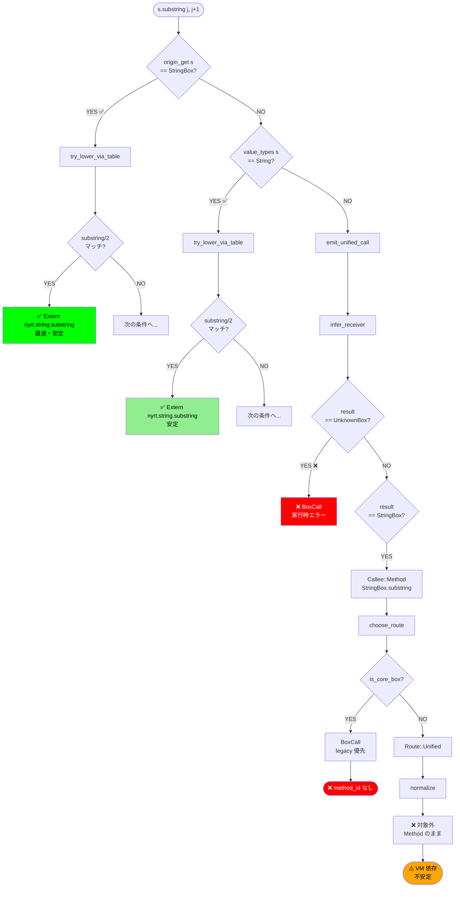
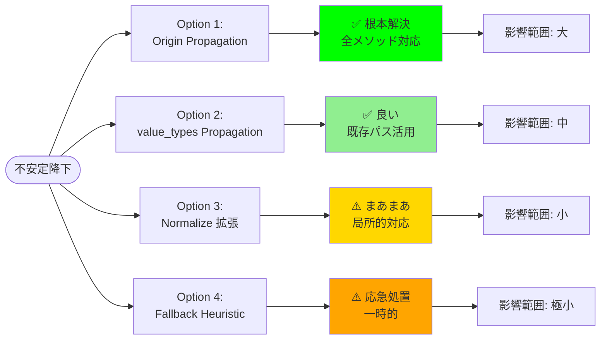

# メソッド降下フローチャート (Visual)

**目的**: `s.substring(j, j+1)` の降下経路を視覚的に理解する

---

## 🎨 完全フローチャート (Mermaid)

```mermaid
flowchart TD
    Start([Method Call: recv.method args])

    Start --> Phase1{Phase 1: Early Routing}

    %% Phase 1: handle_standard_method_call
    Phase1 --> Birth{method == birth?}
    Birth -->|YES| LegacyCall[emit_legacy_call<br/>ModuleFunction]
    LegacyCall --> End1([✅ 終了])

    Birth -->|NO| HasOrigin{origin_get recv<br/>存在?}

    %% Origin が存在する場合
    HasOrigin -->|YES| TryTable1[try_lower_via_table<br/>origin_cls, method, arity]
    TryTable1 --> TableMatch1{lowering table<br/>マッチ?}
    TableMatch1 -->|YES| Extern1[Extern nyrt.string.substring]
    Extern1 --> End2([✅ 終了 - 最速])

    TableMatch1 -->|NO| CoreBox{cls in<br/>Array/Map/String?}
    CoreBox -->|YES| MethodId{resolve_builtin<br/>method_id?}
    MethodId -->|Some id| BoxCall1[BoxCall<br/>method_id]
    BoxCall1 --> End3([✅ 終了])
    MethodId -->|None| Fallback1[Phase 2へ]

    CoreBox -->|NO| Fallback1

    %% Origin が存在しない場合
    HasOrigin -->|NO| InferString{value_types<br/>== String?}
    InferString -->|YES| TryTable2[try_lower_via_table<br/>StringBox, method, arity]
    TryTable2 --> TableMatch2{table<br/>マッチ?}
    TableMatch2 -->|YES| Extern2[Extern nyrt.string.substring]
    Extern2 --> End4([✅ 終了])

    TableMatch2 -->|NO| LengthCheck
    InferString -->|NO| LengthCheck{method in<br/>length/len<br/>arity==0?}

    LengthCheck -->|YES| TryTable3[try_lower_via_table<br/>StringBox, method, arity]
    TryTable3 --> TableMatch3{table<br/>マッチ?}
    TableMatch3 -->|YES| Extern3[Extern nyrt.string.length]
    Extern3 --> End5([✅ 終了])

    TableMatch3 -->|NO| Fallback2[Phase 2へ]
    LengthCheck -->|NO| Fallback2

    %% Phase 2: emit_unified_call
    Fallback1 --> Phase2{Phase 2: Unified Routing}
    Fallback2 --> Phase2

    Phase2 --> Infer[infer_receiver<br/>box_hint, method, recv]
    Infer --> InferResult[class_name<br/>certainty]

    InferResult --> EarlyRewrite{Early Rewrite?}
    EarlyRewrite --> StrLike[try_early_str_like]
    StrLike --> Equals[try_special_equals]
    Equals --> KnownUnique[try_known_or_unique]

    KnownUnique --> ShouldRewrite{should_rewrite?}
    ShouldRewrite -->|cls==StringBox<br/>method==substring| Skip[❌ rewrite しない]
    ShouldRewrite -->|その他| Rewrite[✅ ModuleFunction]
    Rewrite --> End6([✅ 終了])

    Skip --> Convert[convert_target_to_callee]
    Convert --> CalleeMethod[Callee::Method<br/>box_name, method, recv]

    CalleeMethod --> Router[choose_route<br/>box_name, method, certainty]

    Router --> RouteUnknown{box_name<br/>== UnknownBox?}
    RouteUnknown -->|YES| RouteBoxCall[Route::BoxCall]
    RouteBoxCall --> EmitBox[emit_box_or_plugin_call]
    EmitBox --> BoxCall2[BoxCall instruction]
    BoxCall2 --> VMError([❌ 実行時エラー<br/>method_id なし])

    RouteUnknown -->|NO| RouteCore{is_core_box<br/>&&<br/>NOT length?}
    RouteCore -->|YES| RouteBoxCall

    RouteCore -->|NO| RouteUnified[Route::Unified]
    RouteUnified --> Normalize[apply_all<br/>normalize]

    Normalize --> NormString{normalize_string?}
    NormString -->|length/size/len| ExternNorm[Extern nyrt.string.length]
    ExternNorm --> EmitCall

    NormString -->|substring/indexOf| NoNorm[❌ normalize 対象外]
    NoNorm --> StayMethod[Callee::Method のまま]

    StayMethod --> EmitCall[emit_instruction<br/>Call callee]
    EmitCall --> VMResolve([VM で解決<br/>不安定])

    style Extern1 fill:#90EE90
    style Extern2 fill:#90EE90
    style Extern3 fill:#90EE90
    style ExternNorm fill:#90EE90
    style BoxCall1 fill:#FFD700
    style BoxCall2 fill:#FF6B6B
    style VMError fill:#FF0000,color:#FFF
    style VMResolve fill:#FFA500
```

---

## 🔍 substring 専用の簡略版

---

## 📊 3つの経路比較

| 経路 | 条件 | 結果 | 速度 | 安定性 |
|------|------|------|------|--------|
| **Early Table** | origin または value_types が StringBox | `Extern("nyrt.string.substring")` | ⚡ 最速 | ✅ 完全安定 |
| **BoxCall Legacy** | origin が StringBox + method_id 存在 | `BoxCall(method_id)` | 🐢 中速 | ⚠️ 安定 (但し substring は method_id なし) |
| **Unified → VM** | origin 不明 + 推論失敗 | `BoxCall` or `Method` → VM 解決 | 🐌 最遅 | ❌ 不安定 (実行時エラーあり) |

---

## 🎯 安定化の鍵

### ✅ 安定化する条件
1. `origin_register(s, "StringBox")` が呼ばれている
2. `value_types[s] = MirType::String` が設定されている
3. `value_types[s] = MirType::Box("StringBox")` が設定されている

### ❌ 不安定になる条件
1. 引数として受け取った値 (origin なし)
2. 他のメソッドの戻り値 (origin 伝播なし)
3. 複雑な式の結果 (型推論失敗)

---

## 🔧 修正方針の視覚的比較

---

**作成日**: 2025-10-17
**用途**: Task 1 調査結果の視覚化
