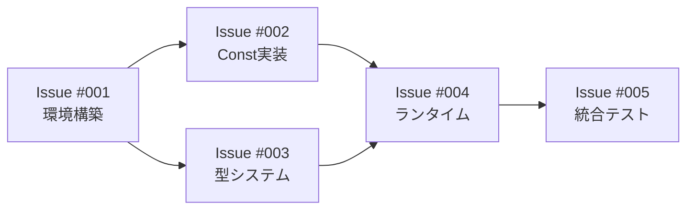

# 📅 Week 1 ロードマップ: LLVM基盤構築

**期間**: 2025年8月21日〜8月27日  
**目標**: LLVMバックエンドの基盤を構築し、最小限のプログラムを実行可能にする

## 🎯 Week 1の全体目標

「return 42」レベルの超シンプルなNyashプログラムが、LLVM経由で実行できる状態を達成する。

## 📋 Issue実装順序

### **Issue #001: inkwellセットアップとHello World** 🚀最初にこれ！
- **期間**: Day 1-3
- **内容**: 環境構築と「return 42」の実行
- **成功条件**: LLVMでコンパイルした実行ファイルが終了コード42を返す
- **ファイル**: [001-setup-inkwell-hello-world.md](./001-setup-inkwell-hello-world.md)

### **Issue #002: Const命令の実装**（#001完了後）
- **期間**: Day 3-4
- **内容**: MIR Const命令をLLVM定数に変換
- **対象**: Integer, Float, Bool定数
- **テスト**: `return 100`, `return 3.14`, `return true`

### **Issue #003: 基本的な型システム**（#002と並行可能）
- **期間**: Day 4-5
- **内容**: MIR型→LLVM型のマッピング実装
- **対象**: i32/i64, f64, bool, 関数型
- **成果**: type_cache の実装

### **Issue #004: ランタイム関数宣言**（#003完了後）
- **期間**: Day 5-6
- **内容**: nyash_runtime_* 関数の宣言
- **対象**: alloc, free, print_int（デバッグ用）
- **準備**: 最小限のCランタイム作成

### **Issue #005: Week 1統合テスト**（最終日）
- **期間**: Day 7
- **内容**: 複数の小さなプログラムでテスト
- **確認**: CI/CDでのLLVMビルド
- **文書**: Week 2への引き継ぎ事項

## 🔄 実装の流れ

## ✅ Week 1完了時のチェックリスト

- [ ] inkwellクレートが正常に動作
- [ ] 「return 42」がLLVM経由で実行可能
- [ ] Integer/Float/Bool定数がサポート済み
- [ ] 基本的な型変換が実装済み
- [ ] 最小限のランタイム関数が宣言済み
- [ ] 5個以上のテストケースがパス

## 📊 リスクと対策

| リスク | 対策 |
|--------|------|
| LLVM環境構築で詰まる | Docker環境を準備、LLVM17固定 |
| inkwellのAPIが複雑 | 公式exampleを参考に最小実装 |
| リンクエラー | まずは静的リンク、動的は後回し |

## 💡 成功のコツ

1. **小さく始める**: return 42が動けば大成功
2. **エラーを恐れない**: LLVMのエラーメッセージは親切
3. **IR出力を確認**: `--emit-llvm`でIRをダンプして確認
4. **既存コード活用**: VM/WASMバックエンドの構造を参考に

## 🎉 Week 1成功時の次のステップ

**Week 2では以下に取り組みます**：
- BinOp（四則演算）の実装
- Branch/Jumpによる制御フロー
- Box型の基本操作
- PHIノードの実装

---

**注意**: 各Issueは独立して実装可能ですが、推奨順序に従うとスムーズです。
ブロッカーがあれば即座にAIチームに相談してください！