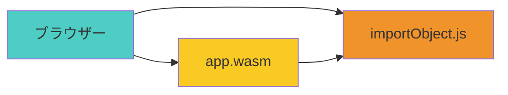
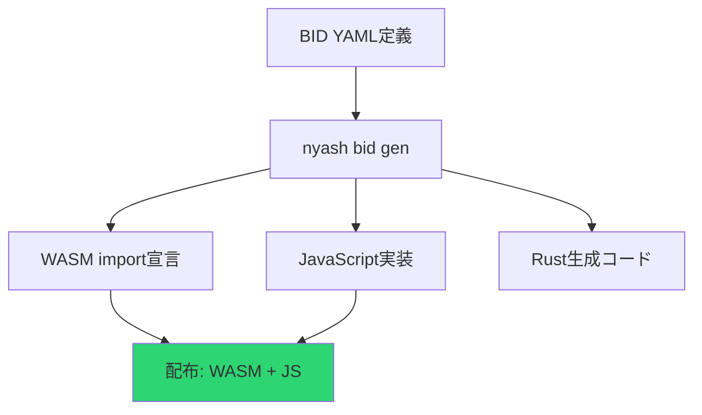

# 🔍 Nyash WASM実行におけるRust依存性分析

## 📅 最終更新: 2025-08-15

## 🎯 概要
Nyash WASMの実行時Rust依存性について、Phase 9.77（手動実装）とPhase 9.8+（FFI基盤）を比較分析し、真のRust依存脱却の実現方法を解説。

## 🔍 重要な発見: 実行時Rust依存性は**ゼロ**

### **結論**
**どちらの方式でも実行時Rust依存はなし！**

| 方式 | コンパイル時 | 実行時 | 配布ファイル |
|------|-------------|--------|-------------|
| **Phase 9.77 (手動)** | ❌ Rust必要 | ✅ **Rust不要** | .wasm + .js のみ |
| **Phase 9.8+ (FFI)** | ❌ Rust必要 | ✅ **Rust不要** | .wasm + .js のみ |

## 🛠️ Phase 9.77: 手動実装アプローチ

### **特徴**
- 基本的なCanvas/Console操作を手動でWASM import実装
- 緊急復旧に最適（1-2週間で完了）
- 実行時はWASM + JavaScriptのみ

### **実行時依存関係**


### **生成例**
```bash
# コンパイル時 - Rust必要
cargo build --target wasm32-unknown-unknown
# → app.wasm 生成

# 実行時 - Rust完全不要！
# ブラウザーでWASM + JavaScriptのみ
```

## 🚀 Phase 9.8+: FFI基盤アプローチ

### **特徴**  
- BID（Box Interface Definition）からの自動生成
- 新API追加が数分で完了
- 長期開発効率の飛躍的向上

### **自動生成フロー**


### **生成コマンド**
```bash
# BID定義から自動生成
nyash bid gen --target wasm bid/canvas.yaml

# コンパイル
cargo build --target wasm32-unknown-unknown

# 実行時 - Rust完全不要！
# 同じくWASM + JavaScriptのみ
```

## 📦 配布ファイル構成（共通）

どちらの方式でも、配布時は以下のファイルのみ:

```
my_nyash_app/
├── app.wasm           # コンパイル済みWASM（Rust不要）
├── runtime.js         # importObject実装（JavaScript）
├── index.html         # HTMLページ
└── README.md          # 使用説明
```

## 🌐 実際の実行例

### **HTMLファイル**（Rust一切不要）
```html
<!DOCTYPE html>
<html>
<head><title>Nyash App</title></head>
<body>
    <canvas id="gameCanvas" width="400" height="300"></canvas>
    <script src="runtime.js"></script>
    <script>
        // WASMロード・実行（Rust依存なし）
        WebAssembly.instantiateStreaming(
            fetch('app.wasm'), 
            importObject
        ).then(instance => {
            instance.exports.main();
        });
    </script>
</body>
</html>
```

### **実行環境要件**
- ✅ モダンブラウザー（Chrome, Firefox, Safari, Edge）
- ✅ WebAssembly対応
- ❌ Rust不要
- ❌ Node.js不要  
- ❌ 特別なランタイム不要

## 📊 方式比較詳細

| 評価軸 | Phase 9.77 手動 | Phase 9.8+ FFI |
|--------|-----------------|----------------|
| **実行時Rust依存** | ❌ なし | ❌ なし |
| **配布ファイル** | WASM + JS | WASM + JS |
| **開発時間** | 1-2週間 | 3-4週間 |
| **API追加工数** | 数時間（手動） | 数分（自動） |
| **保守性** | 低 | 高 |
| **拡張性** | 限定的 | 無制限 |
| **学習コスト** | 中 | 高 |

## 🎯 実用的選択指針

### **Phase 9.77を選ぶべき場合**
- ✅ **即座にRust依存脱却したい**
- ✅ **基本的なCanvas/Console操作で十分**
- ✅ **短期プロジェクト**
- ✅ **学習コスト最小化**

### **Phase 9.8+を選ぶべき場合**
- ✅ **長期開発プロジェクト**
- ✅ **多様な外部API統合が必要**
- ✅ **チーム開発**
- ✅ **API拡張の自動化が重要**

## 💡 戦略的アプローチ

### **段階的進化パス**


### **推奨戦略**
1. **Phase 9.77**: 手動実装で即座にRust依存脱却
2. **検証**: 実用性・性能確認
3. **Phase 9.8+**: 必要に応じてFFI基盤へ移行

## 🎉 期待される効果

### **即時効果（Phase 9.77）**
- **Rust依存完全排除**（実行時）
- **配布の簡素化**
- **ブラウザー単体実行**
- **学習コスト削減**

### **長期効果（Phase 9.8+）**
- **開発効率の飛躍的向上**
- **API拡張の自動化**  
- **チーム開発の標準化**
- **エコシステム拡充**

## 🔗 関連ドキュメント

### **技術仕様**
- [FFI/ABI仕様](../reference/box-design/ffi-abi-specification.md)
- [実行バックエンド](../execution-backends.md)

### **実装計画**  
- [Phase 9.77詳細](../../予定/native-plan/issues/phase_9_77_wasm_emergency.md)
- [Copilot Issues](../../予定/native-plan/copilot_issues.txt)

### **問題分析**
- [WASM現在の問題](../../予定/wasm/current_issues.md)

---

**この分析により、NyashはWASMを通じて真のRust依存脱却を実現し、ブラウザー環境での自由な実行が可能になります。** 🚀