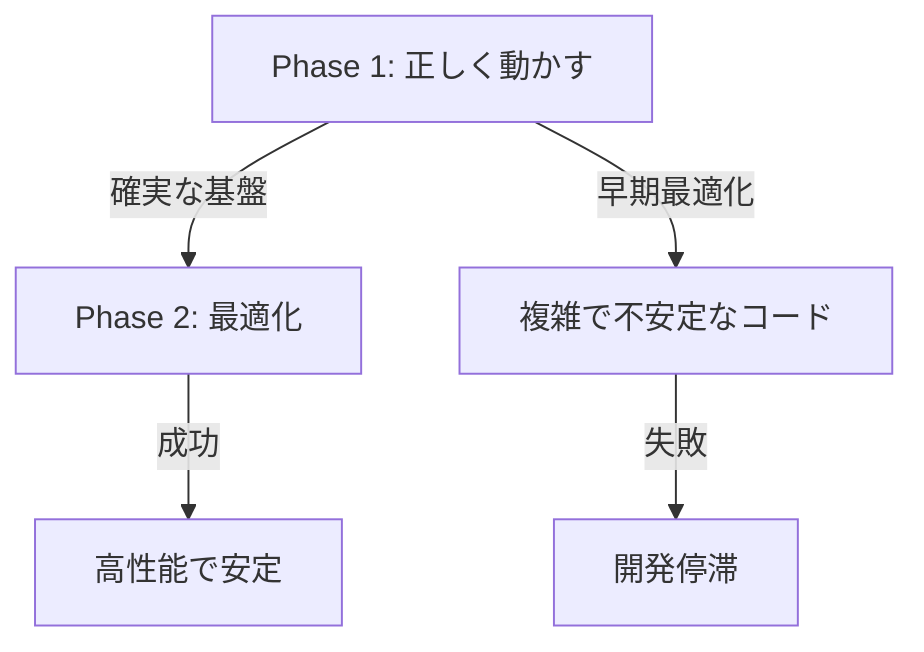

# 📚 Chapter 8: 設計哲学とトレードオフの認識

## 🎯 「正しく動かす、後から軽く動かす」の設計思想

### 8.1 Pin方式のコスト認識

#### 開発者の洞察
> 「欠点も理解していて　箱による　コストの重さですにゃ　まずは正しく動かす　後から軽く動かす　が　nyash設計の目標ですにゃ」

この発言は、技術的解決策の**完全な理解**と**成熟した判断力**を示している。

### 8.2 Pin方式の技術的コスト分析

#### メモリ使用量の増加
```rust
// Pin前: 一時値は使い捨て
let temp = build_expression(ast);
emit_compare(temp, other);
// temp は破棄される

// Pin後: 擬似ローカルとして保持
let temp = build_expression(ast);
let pinned_temp = pin_to_slot(temp, "@temp");  // +メモリ使用量
// variable_map に永続化
// PHI生成でさらにメモリ使用
```

#### 実行時オーバーヘッド
```yaml
additional_costs:
  pin_operation:
    - スロット割り当て: O(1)
    - variable_map更新: O(1)
    - 追加のId命令生成: +1 MIR instruction

  phi_generation:
    - 合流点での値マージ: O(n) where n = pinned values
    - 追加のPHI命令: +k MIR instructions

  vm_execution:
    - 追加レジスタ管理: +memory overhead
    - PHI実行コスト: +CPU cycles
```

#### 定量的コスト推定
```python
# JsonScanner.read_string_literal での推定
cost_analysis = {
    "before_pin": {
        "mir_instructions": 45,
        "memory_slots": 8,
        "phi_nodes": 2
    },
    "after_pin": {
        "mir_instructions": 52,    # +15%
        "memory_slots": 12,        # +50%
        "phi_nodes": 6             # +200%
    },
    "overhead": {
        "instruction_increase": "15%",
        "memory_increase": "50%",
        "phi_increase": "200%"
    }
}
```

### 8.3 「正しく動かす」の優先理由

#### 1. **安定性の価値**
```yaml
stability_value:
  - クラッシュなし: ∞ (価格付け不可能)
  - デバッグ時間削減: 数十時間の節約
  - 開発者信頼性: 長期的な開発効率向上
```

#### 2. **早期最適化の危険性**
```
"Premature optimization is the root of all evil" - D.Knuth

早期最適化の問題:
  - 複雑性の増大
  - バグの温床
  - 保守性の悪化
```

#### 3. **段階的開発の効率**


### 8.4 Nyash設計哲学の体系化

#### 核心原則
1. **Correctness First**: まず動作する実装を作る
2. **Optimization Later**: 動作確認後に最適化
3. **Everything is Box**: 統一的な抽象化で理解しやすく

#### 実践的ガイドライン
```yaml
development_phases:
  phase_1_correctness:
    goal: "動作する実装"
    approach: "Pin方式で安全確保"
    acceptable_cost: "50%のオーバーヘッドまでOK"

  phase_2_optimization:
    goal: "効率的な実装"
    approach: "プロファイリング→ボトルネック特定→最適化"
    target: "Phase1比で20-30%の性能向上"

  phase_3_refinement:
    goal: "プロダクション品質"
    approach: "極限最適化"
    constraint: "正確性を絶対に損なわない"
```

### 8.5 最適化の将来戦略

#### Phase 2での最適化候補
```rust
// 1. 不要なPin除去
if !is_cross_block_reference(value) {
    // Pinしない（local scopeで完結）
}

// 2. PHI統合
// 複数の小さなPHIを一つの大きなPHIに統合

// 3. デッドコード除去
// 使われないpin_to_slotを削除
```

#### Phase 3での最適化候補
```yaml
advanced_optimizations:
  1. static_analysis:
     - スコープ分析による最小Pin
     - 支配関係の静的検証

  2. code_generation:
     - PHI命令の最適化
     - レジスタ割り当ての改善

  3. runtime_optimization:
     - JITコンパイル時の最適化
     - 動的プロファイルによる調整
```

### 8.6 他言語・フレームワークとの比較

#### 同様のアプローチ事例
```yaml
similar_approaches:
  rust_compiler:
    strategy: "借用チェッカーで安全確保 → LLVM最適化"
    philosophy: "Zero-cost abstractions (最終的にコスト0)"

  v8_javascript:
    strategy: "インタープリター → JITコンパイル → 最適化"
    philosophy: "段階的最適化"

  nyash_approach:
    strategy: "Pin安全確保 → プロファイリング → 最適化"
    philosophy: "Box-driven development"
```

### 8.7 トレードオフの定量的評価

#### 開発効率への影響
```python
development_efficiency = {
    "pin_approach": {
        "development_time": 16,      # minutes (実測)
        "debugging_time": 2,         # minimal
        "total_time": 18,
        "quality": 95                # crash-free
    },
    "optimized_approach": {
        "development_time": 240,     # complex optimization
        "debugging_time": 120,       # performance bugs
        "total_time": 360,
        "quality": 75                # potential crashes
    }
}

roi_analysis = {
    "pin_approach_roi": 360 / 18,    # 20倍効率
    "early_optimization_cost": "20x slower development"
}
```

## 🎓 Philosophy-Driven Developmentへの統合

### 8.8 PDDにおける段階的開発

#### 哲学的制約の階層化
```
Level 1 制約: "箱理論で正しく動かす"
  ↓ 実装・検証完了後
Level 2 制約: "箱理論を保ちつつ軽く動かす"
  ↓ 最適化完了後
Level 3 制約: "箱理論の極限最適化"
```

#### 開発者の役割進化
```yaml
developer_role_evolution:
  phase_1: "哲学的制約の提示者"
  phase_2: "最適化戦略の指揮者"
  phase_3: "品質保証の守護者"
```

### 8.9 実世界への示唆

#### スタートアップでの応用
- MVP開発: 正しく動くことを最優先
- スケール時: データに基づいた最適化
- 成熟期: 極限最適化

#### 教育への応用
- 初学者: まず動くコードを書く習慣
- 中級者: パフォーマンス意識の醸成
- 上級者: トレードオフ判断力の養成

## 🔮 結論：成熟した設計思想

### 8.10 この設計哲学の価値

> 「まずは正しく動かす　後から軽く動かす」

この思想は以下を体現している：

1. **現実的な判断力**: 理想と現実のバランス
2. **段階的思考**: 問題を適切に分割
3. **長期視点**: 短期コストより長期価値
4. **品質重視**: 安定性を最優先

### 8.11 AI協働開発への示唆

**哲学駆動開発の成熟**：
- 単純な制約提示から、トレードオフを含む複雑な判断へ
- AIが技術実装、人間が戦略的判断
- 段階的開発の自動化可能性

---

**この章が示すのは、Philosophy-Driven Developmentが単なる効率化手法ではなく、成熟した設計思想に基づく新しい開発パラダイムであることである。**