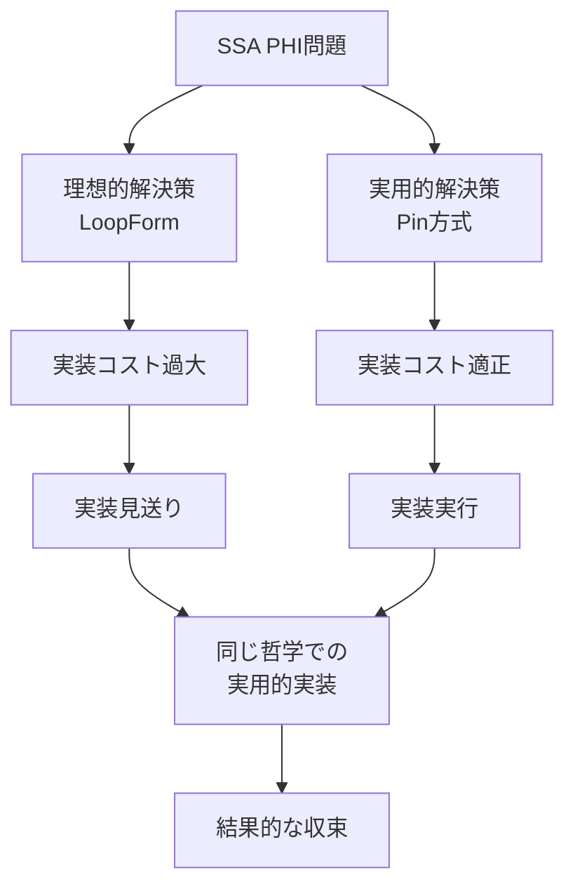

# 📚 Chapter 9: LoopForm vs Pin — 設計空間の探索と収束

## 🚬 タバコ休憩20分の天才的直感

### 9.1 LoopFormの誕生

#### 発見の経緯
```yaml
context: Nyash開発中の休憩時間
duration: 20分のタバコ休憩
inspiration: "完璧な解決策"への直感的到達
result: LoopForm設計の完全構想
```

#### 核心アイデア
> 「ループで発生する複数変数の状態をタプル（Carrier）に束ね、1個のPHIで管理する」

```rust
// 問題：複数変数のPHI管理
while (condition) {
    var1 = update1(var1);  // ← PHI必要
    var2 = update2(var2);  // ← PHI必要
    var3 = update3(var3);  // ← PHI必要
}

// LoopForm解決：統一タプル管理
let carrier = (var1, var2, var3);
head:
  let (var1, var2, var3) = phi_carrier;  // ← 1個のPHIで全解決！
  if !condition goto exit;
  let next_carrier = (update1(var1), update2(var2), update3(var3));
  phi_carrier = φ(carrier, next_carrier);
  goto head;
```

### 9.2 設計の完璧性

#### 構造的美しさ
```yaml
loopform_benefits:
  architectural:
    - 1個のPHI命令で全状態管理
    - 自動的なPHIグルーピング
    - 構造的に破綻しない設計

  optimization:
    - LLVM最適化の恩恵を最大化
    - メモリアクセスパターンの最適化
    - ループ不変量の自動認識

  maintainability:
    - 概念モデルの単純性
    - デバッグの容易性
    - 拡張性の高さ
```

#### break/continueの自然な処理
```rust
// break: 現在のcarrierで脱出
break => goto exit with current_carrier;

// continue: 次のcarrierでループ継続
continue => phi_carrier = next_carrier; goto head;
```

### 9.3 実装コストの現実

#### ChatGPTによる実装コスト評価
> 「結局コストが重いとchatgptにことわられました」

```yaml
implementation_requirements:
  macro_system:
    - 完全なマクロ展開システム
    - AST変換の複雑な処理
    - 衛生マクロ（gensym）システム

  type_system:
    - タプル型の完全サポート
    - 自動的な型推論
    - パターンマッチング

  runtime_support:
    - タプルの効率的な実装
    - ガベージコレクションとの統合
    - デバッグ情報の保持

estimated_effort:
  development_time: "3-6ヶ月"
  code_complexity: "2000-3000行の追加"
  maintenance_burden: "高"
```

## 🔄 Pin方式への収束

### 9.4 実用的妥協の智恵

#### Pin方式の採用理由
```yaml
pin_approach_advantages:
  implementation:
    - 既存システムへの最小変更
    - 段階的導入が可能
    - 実装コスト：数時間

  risk_management:
    - 失敗時の影響範囲が限定
    - ロールバックが容易
    - 他システムへの影響なし

  immediate_value:
    - 今すぐ問題解決
    - 学習コストが低
    - 既存コードとの互換性
```

### 9.5 設計収束の分析

#### 驚くべき類似性
```python
# LoopFormの哲学
loopform_philosophy = "複数状態を1つの箱（タプル）に統合"

# Pin方式の哲学
pin_philosophy = "一時値を適切な箱（スロット）に昇格"

# 共通原理
common_principle = "適切な箱（スコープ）の設計"
```

#### 収束パターン


## 🧠 認知科学的考察

### 9.6 創造的思考の解析

#### タバコ休憩の認知効果
```yaml
cognitive_factors:
  relaxation:
    - 論理的制約からの解放
    - 創発的思考の促進
    - 全体的視点の獲得

  time_pressure:
    - 20分という適度な制約
    - 本質的問題への集中
    - 完璧主義の抑制

  physical_activity:
    - 歩行による思考活性化
    - 環境変化による刺激
    - リフレッシュ効果
```

#### 直感的設計の価値
> 「完璧に解決しようとしたのが loopform という考え」

この発言は**設計者の成熟度**を示す：
1. **問題の本質理解**：PHI問題の根本原因
2. **理想解の構想**：完璧な解決策の設計
3. **現実的判断**：コストとのバランス考慮

### 9.7 設計空間の探索プロセス

#### 2段階の最適化
```
Stage 1: 理想的解決策の探索
  - 制約を無視した完璧な設計
  - 創造性を最大化
  - LoopForm概念の誕生

Stage 2: 制約下での最適化
  - 実装コストの現実的評価
  - 段階的解決策の模索
  - Pin方式への収束
```

#### 設計の進化
```python
evolution_pattern = {
    "initial_problem": "SSA PHI管理の複雑性",
    "ideal_solution": "LoopForm（完璧だが重い）",
    "practical_solution": "Pin方式（実用的で軽い）",
    "convergence": "同じ哲学の異なる実装"
}
```

## 🎯 Philosophy-Driven Developmentへの示唆

### 9.8 階層的制約設計

#### 制約の階層化
```
Level 0: 哲学的制約（"箱理論"）
Level 1: 理想的制約（"完璧な箱の統合"）
Level 2: 実用的制約（"実装可能な箱の設計"）
```

#### PDDの拡張モデル
```yaml
extended_pdd:
  phase_1_inspiration:
    - リラックス状態での自由な発想
    - 制約を無視した理想解の探索
    - 創造性の最大化

  phase_2_evaluation:
    - AI（ChatGPT）による実装コスト評価
    - 現実的制約の考慮
    - トレードオフ分析

  phase_3_convergence:
    - 哲学を保った実用解への収束
    - 段階的実装戦略
    - 長期的価値の維持
```

### 9.9 「諦める」ことの価値

#### 賢い妥協の智恵
> 「結局コストが重いとchatgptにことわられました」

この**諦め**は実は：
- **優先順位の明確化**
- **リソースの最適配分**
- **段階的改善への道筋**

#### 設計債務としてのLoopForm
```yaml
technical_debt_positive:
  concept: "実装されなかったLoopForm"
  value: "将来への設計指針"
  benefit: "より良い解決策への道標"
```

## 🚀 将来への展望

### 9.10 LoopForm復活の条件

#### 実装タイミング
```yaml
revival_conditions:
  - Nyashエコシステムの成熟
  - マクロシステムの安定化
  - 十分な開発リソース確保
  - パフォーマンスボトルネックの顕在化
```

#### 段階的実装戦略
```
Phase A: Pin方式での経験蓄積
Phase B: 限定的LoopForm試験実装
Phase C: 段階的移行
Phase D: 完全なLoopFormシステム
```

### 9.11 設計パターンとしてのLoopForm

#### 他言語・システムへの応用
```yaml
applications:
  compiler_design:
    - ループ最適化パス
    - SSA PHI最適化
    - 状態管理の統一化

  language_design:
    - ループ構文の設計指針
    - 状態管理プリミティブ
    - 最適化フレンドリー構文

  system_architecture:
    - 状態管理の統一化
    - 複雑性の局所化
    - 構造的美しさの追求
```

## 💡 結論

### 9.12 創造と妥協の弁証法

この事例は以下を示している：

1. **創造的直感の価値**：タバコ休憩20分での完璧な解決策
2. **現実的判断の重要性**：実装コストを冷静に評価
3. **哲学の一貫性**：異なる実装でも同じ原理
4. **段階的改善**：理想への道筋を保持

### 9.13 Pin vs LoopFormの統合的理解

```
LoopForm = 理想的な箱の設計（完璧だが重い）
Pin方式 = 実用的な箱の設計（軽量で実装可能）

共通哲学: "適切なスコープ（箱）の構築"
```

### 9.14 Philosophy-Driven Developmentの成熟

この事例は、PDDが単なる効率化手法ではなく、**創造的思考と実用的判断を統合する成熟した開発パラダイム**であることを示している。

---

**タバコ休憩20分の天才的直感と、その後の現実的収束。この全プロセスこそが、真の設計者の思考パターンである。**