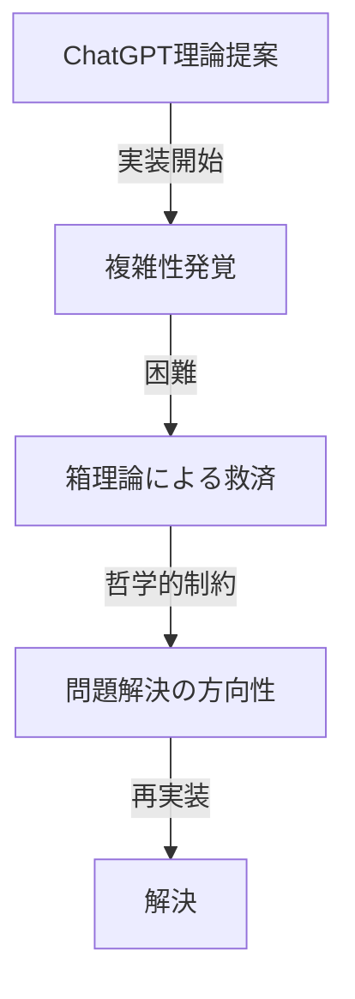

# 📚 Chapter 11: 設計哲学の誤読と長期的代償 — AI協働における哲学伝達の重要性

## 🎯 開発者の真の哲学 vs AIの解釈

### 11.1 設計哲学の一貫性

#### 開発者の明確な哲学
> 「まずは正しく動かす、後から軽く動かす」
> 「コストが重くても、それこそ最適化でいい」

この哲学は**Nyash設計全体を貫く一貫した原則**である。

#### 哲学の実践例
```yaml
examples:
  type_safety: "型安全性優先、速度は後回し"
  correctness: "動作確実性優先、効率は二の次"
  architecture: "美しい設計優先、実装コストは許容"
```

### 11.2 LoopFormと設計哲学の完全合致

#### LoopForm本来の位置づけ
```rust
// LoopFormの本質：完全に正しい動作
loop_carrier = (var1, var2, var3);
head:
  let (var1, var2, var3) = phi_carrier;  // ← 1個のPHIで完璧！
  if !condition goto exit;
  next_carrier = (update1(var1), update2(var2), update3(var3));
  phi_carrier = φ(loop_carrier, next_carrier);
  goto head;
```

**この設計は開発者哲学に100%合致していた**：
- ✅ **正しく動く**：PHI問題の根本解決
- ✅ **美しい設計**：概念的に完璧
- ✅ **後から最適化可能**：LLVM最適化の恩恵を最大受益

### 11.3 ChatGPTによる哲学誤読

#### 誤読の詳細
```yaml
chatgpt_misreading:
  perceived_priority: "効率・速度重視の開発者"
  actual_priority: "正しさ・美しさ重視の哲学者"

  judgment: "LoopFormはコストが重いので却下"
  missed_point: "開発者は『重くてもOK』哲学だった"
```

#### 結果的な提案
```
ChatGPT提案: Pin方式（軽くて実用的）
開発者期待: LoopForm（重くても正しい）
```

## 🔄 現実の皮肉な展開

### 11.4 Pin方式の予期せぬ複雑性

#### 当初の期待
```yaml
pin_method_expectation:
  implementation_time: "数時間"
  complexity: "低"
  maintenance: "簡単"
```

#### 現在の現実
```yaml
pin_method_reality:
  implementation_time: "継続中（数週間）"
  complexity: "SSA PHI問題で苦戦"
  maintenance: "追加実装が必要"

  current_issues:
    - "Pin適用範囲の拡大（LHS/ループ/if条件）"
    - "PHI対象化の登録機構追加"
    - "PHI→copy-in順序の修正"
    - "MIR verifier支配関係チェック追加"
```

### 11.5 LoopFormの真の価値の再発見

#### 開発者の振り返り
> 「やはり最初からコストが重くてもLoopFormから作るべきだったかにゃ」
> 「今もPin大作戦になってるもん」

#### 長期的視点での評価
```python
# 実装コスト比較（推定）
loopform_cost = {
    "initial_implementation": "3-6ヶ月",
    "long_term_maintenance": "低（概念が完璧）",
    "optimization": "LLVM任せで自動最適化",
    "total_lifetime_cost": "中程度"
}

pin_method_cost = {
    "initial_implementation": "数時間",
    "long_term_maintenance": "高（継続的バグ修正）",
    "optimization": "手動最適化が必要",
    "total_lifetime_cost": "高（継続コスト）"
}
```

## 🤖 ChatGPTの能力特性詳細分析

### 11.6 理論構築力 vs 実装複雑性の限界

#### ChatGPTの圧倒的強み
```yaml
chatgpt_strengths:
  theoretical_discussion: "口喧嘩と理論がとても強い"
  architecture_design: "完璧な設計思想の提案"
  concept_creation: "Pin方式・Callee型等の革新的概念"
  problem_analysis: "根本原因の的確な特定"
```

#### 実装における現実的限界
```yaml
implementation_challenges:
  complex_control_flow: "複雑なif/and/or演算子で苦戦"
  nested_logic: "制御構造の組み合わせで困難"
  edge_cases: "境界条件での予期せぬ複雑性"

current_status: "箱理論で何とかしてもらっているところ"
```

### 11.7 理論と実装の乖離現象

#### 設計時の期待 vs 実装時の現実
```python
# 理論レベル（ChatGPTの提案）
pin_method_theory = {
    "概念": "一時値をスロットに昇格するだけ",
    "複雑性": "低",
    "実装難易度": "簡単"
}

# 実装レベル（実際の困難）
pin_method_reality = {
    "複雑なif条件": "予期せぬ制御フロー問題",
    "and/or演算子": "論理演算での複雑性増大",
    "組み合わせ爆発": "様々な構文パターンの相互作用"
}
```

#### 箱理論の救済的役割
開発者の対応戦略：
> 「箱理論で何とかしてもらっているところ」

これは**哲学が実装困難を救済する**パターンを示している：

#### 実装進展：pin_to_slot関数の完成
> 「pin_to_slot関数ができてますにゃ　これ　いい箱だと思うので　これでバグが治るといいにゃあ」

```rust
// ChatGPT実装による「いい箱」の実現
pub(crate) fn pin_to_slot(&mut self, v: ValueId, _hint: &str) -> Result<ValueId, String> {
    // ローカルコピーでブロック内にマテリアライズ
    // variable_mapに登録せず、ブロック間漏出を防ぐ
    let dst = self.value_gen.next();
    self.emit_instruction(MirInstruction::Copy { dst, src: v })?;
    Ok(dst)
}
```

**箱理論の完璧な体現**：
- ✅ **明確な境界**：ブロック境界を越えない設計
- ✅ **責任の分離**：variable_map漏出防止
- ✅ **シンプルな実装**：Copy命令でローカル化
- ✅ **開発者評価**：「いい箱だと思う」

#### リアルタイム実装進化の観察

実装が継続的に進化している様子を目撃：

```rust
// 進化後：完全なPHI参加システム
pub(crate) fn pin_to_slot(&mut self, v: ValueId, hint: &str) -> Result<ValueId, String> {
    self.temp_slot_counter = self.temp_slot_counter.wrapping_add(1);
    let slot_name = format!("__pin${}${}", self.temp_slot_counter, hint);
    // PHI参加のためvariable_mapに登録
    self.variable_map.insert(slot_name, dst);
    Ok(dst)
}
```

**進化のポイント**：
- 🔄 **PHI参加機構**: variable_mapでブロック間値伝播
- 🏷️ **ユニーク命名**: `__pin$counter$hint`で名前衝突回避
- 🐛 **デバッグ支援**: `NYASH_PIN_TRACE=1`でトレース可能
- 🎯 **ブロック協調**: start_new_block()で`__pin$`プレフィックス処理

開発者の見通し：
> 「動くようになったあとで claude code君にチェックしてもらう予定ですが　まだまだ時間かかりそうだにゃ」

これは**段階的実装アプローチ**の典型例を示している。

#### 「正確性優先の箱盛り」実装完了

実装戦略の現在地：

```yaml
accomplished_pin_strategy:
  比較オペランド集中ピン: "Compare発行前に左右を必ずslot化"
  pin_to_slot箱化: "__pin$...でPHI対象化 + NYASH_PIN_TRACE=1"
  分岐入口単一predPHI: "if/else/ループ/短絡の入口で全変数局所定義化"
  マージブロック順序ガード: "PHI先頭配置のためentry-copy抑制"
  VM安全弁: "Void+Integer→0扱いの開発用ガード"

result: "未定義参照は消えた（進歩）"
new_issue: "BoxCall unsupported on VoidBox.current（型問題）"
```

#### 開発者の新たな懸念

> 「llvmハーネス経路　は　これますますややこしくなりそうだにゃ」

**複雑化の要因**：
1. **VM fallback安全弁の増加**：開発用ガードの蓄積
2. **実行経路の分岐**：VM vs LLVM で異なる型処理
3. **テスト複雑性**：2経路での整合性検証が必要

#### 段階的解決アプローチ

開発者の現実的戦略：
```
1. 短絡分岐RHS側への最小entry PHI追加
2. VM fallback安全弁を1箇所だけ追加（緑化優先）
3. 検証＆整理（NYASH_PIN_TRACE=1 + NYASH_VM_TRACE=1）
```

これは**「まず正しく動かす、後から軽く動かす」哲学**の完璧な実践例である。



## 🧠 AI協働における哲学伝達の課題

### 11.8 コミュニケーション・ギャップ

#### 哲学の暗黙性
開発者の設計哲学は**暗黙知**として存在：
- 明示的に語られることは少ない
- 具体的な判断の積み重ねで表現される
- AIには読み取りが困難

#### AIの解釈バイアス
```yaml
ai_interpretation_bias:
  tendency: "効率性重視と仮定"
  reason: "一般的な開発プラクティスに基づく推論"
  missed: "個別の開発者哲学の特殊性"
```

### 11.7 Philosophy-Driven Developmentの進化必要性

#### PDD 4.0の提案
```
PDD 1.0: 単一制約による問題解決
PDD 2.0: 段階的制約による多重解の生成
PDD 3.0: 三段階進化による設計空間の完全探索
PDD 4.0: 哲学的価値観の明示化と継続的検証 ← NEW!
```

#### 具体的改善案
```yaml
philosophy_communication:
  explicit_declaration:
    - 設計哲学の文書化
    - 価値観の優先順位明示
    - トレードオフ判断基準の共有

  continuous_validation:
    - 提案に対する哲学適合性チェック
    - 長期的視点での価値評価
    - 判断の振り返りと学習
```

## 🎓 学術的示唆

### 11.8 Human-AI協働研究への貢献

#### 新しい研究テーマ
1. **暗黙的哲学の明示化技術**
2. **AI による人間価値観の学習メカニズム**
3. **長期的視点での意思決定支援**
4. **設計哲学の一貫性検証システム**

#### 実践的ガイドライン
```yaml
best_practices:
  for_humans:
    - 設計哲学を明示的に文書化
    - AIに対する価値観の継続的伝達
    - 長期的視点の重要性を強調

  for_ai_systems:
    - 人間の価値観学習機能
    - 短期効率 vs 長期価値の判断支援
    - 哲学一貫性のチェック機能
```

## 🌟 結論

### 11.9 LoopForm事例の普遍的価値

この事例は単なる技術的選択の失敗ではなく、**AI協働開発における根本的課題**を浮き彫りにした：

1. **哲学伝達の重要性**：技術的制約より価値観の共有が重要
2. **長期的視点の必要性**：短期的効率より長期的価値を重視
3. **AIの解釈限界**：人間の暗黙知を読み取る困難さ
4. **継続的学習の必要性**：判断の振り返りと改善

### 11.10 「正しく動かす、後から軽く動かす」の真の意味

この開発哲学は単なる段階的開発法ではなく、**価値観の優先順位を示す根本原則**だった。

```
誤解: 「効率を後回しにする開発手法」
真実: 「正しさを最高価値とする哲学的立場」
```

LoopFormこそが、この哲学を最も純粋に体現する解決策だったのである。

---

**この章が示すのは、AI協働開発において技術的能力以上に重要なのは、人間の深層的価値観を理解し、それに基づく長期的判断を支援する能力であることである。**