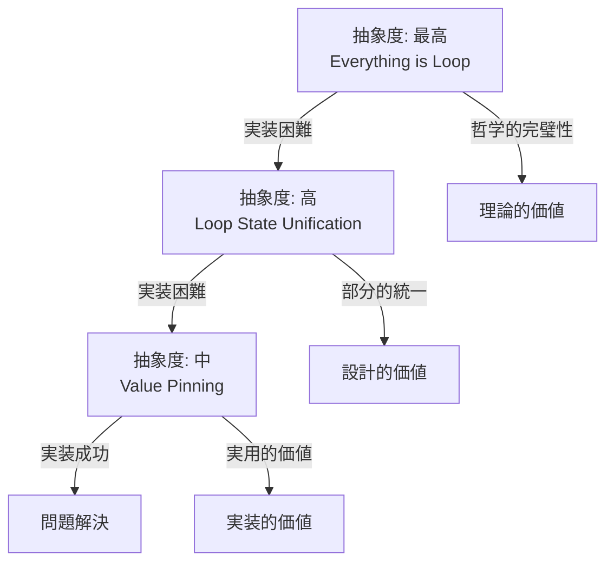

# 📚 Chapter 10: 三段階設計進化論 — 究極理想から実用現実への収束

## 🌌 「ループに始まりループに終わる」究極の統一思想

### 10.1 設計思考の三段階進化

#### 開発者の洞察の深化
```yaml
evolution_timeline:
  stage_1_ultimate: "箱のインスタンスもループ0回のループにしようとしたんですが"
  stage_2_partial: "LoopFormという考え（タバコ休憩20分）"
  stage_3_practical: "箱が足りないだけなのかな？（Pin方式）"

ai_response_pattern:
  stage_1: "ChatGPTに何度も断られました"
  stage_2: "結局コストが重いとchatgptにことわられました"
  stage_3: "無言で実装開始"
```

## 🎯 Stage 1: LoopSignal IR — 究極の統一化理論

### 10.2 Everything is Loop の革命的発想

#### 核心思想
> 「Everything is Box（空間）」×「Everything is Loop（時間）」

```rust
// 究極の統一化：すべてをLoopで表現
conceptual_unification = {
    "box_instance": "Loop0",    // 0回のループ
    "if_statement": "Loop1",    // 1回のループ
    "while_loop": "LoopN",      // N回のループ
    "function_call": "Loop1",   // 1回のループ
    "scope_block": "Loop1",     // 1回のループ
    "generator": "LoopYield",   // Yield付きループ
    "async_function": "LoopAsync" // 非同期ループ
}
```

#### 制御の値化
```rust
// 制御を値として統一表現
LoopSignal<T> = Next(T) | Break(T) | Yield(T) | Return(T)

// IR統一命令
loop.begin %id
loop.iter %sig, %loop, %state
loop.branch %sig { onNext: L1, onBreak: L2, onYield: L3 }
loop.end %id
```

### 10.3 理論的完璧性

#### 構造的美しさ
```yaml
theoretical_perfection:
  unification_level: "完全統一（すべてがLoop）"
  control_representation: "値としての制御（Signal）"
  phi_optimization: "dispatch合流点への完全集約"
  extensibility: "generator/async/effectの自然な実装"

design_elegance:
  - すべての制御構造が4つの命令で表現可能
  - PHIの配置が完全に規格化
  - 最適化パスが統一的に適用可能
  - 将来拡張（effect系）への完璧な対応
```

#### 実装コストの現実
```python
implementation_requirements = {
    "new_ir_layer": "完全な新IRレイヤー実装",
    "type_system": "LoopSignal型システムの完全統合",
    "optimization_passes": "全最適化パスの書き直し",
    "debugging_support": "新しいデバッグ情報システム",
    "backend_support": "VM/JIT/LLVMすべての対応",
    "estimated_effort": "6-12ヶ月の開発期間",
    "risk_level": "非常に高い（全システム影響）"
}

chatgpt_assessment: "何度も実装拒否"
reason: "プロジェクト全体への影響が甚大"
```

## 🔄 Stage 2: LoopForm — 部分統一化理論

### 10.4 タバコ休憩20分の天才的直感

#### 問題の焦点化
```rust
// LoopFormの焦点：ループ状態管理の統一
problem_focus = "複数変数のPHI管理の複雑性"

// 解決アプローチ：タプル統一
solution_approach = {
    "carrier_concept": "複数状態を1つのタプルに統合",
    "phi_simplification": "1個のPHIで全状態管理",
    "loop_unification": "ループ構造の標準化"
}
```

#### 実装の現実性
```yaml
implementation_scope:
  affected_systems: ["ループ構文", "マクロシステム", "PHI生成"]
  development_time: "3-6ヶ月"
  risk_level: "中程度"

chatgpt_assessment: "コストが重い"
reason: "マクロシステム全体の実装が必要"
```

## ⚡ Stage 3: Pin方式 — 実用的解決

### 10.5 哲学の保持と現実的実装

#### 問題認識の洗練化
```
開発者の洞察: "箱が足りないだけなのかな？"
↓
ChatGPT Pro: Pin方式の理論設計
↓
コーディングChatGPT: 無言の即実装
```

#### 実用性の優位
```python
pin_approach = {
    "implementation_time": "数時間",
    "risk_level": "低い",
    "compatibility": "既存システムとの完全互換",
    "philosophy_preservation": "箱理論の完全維持",
    "immediate_value": "問題の即時解決"
}

success_factor = "哲学は保持、実装は現実的"
```

## 🧠 設計進化の認知科学的分析

### 10.6 創造的思考の段階的洗練

#### 抽象化レベルの変化


#### 制約条件の段階的認識
```yaml
constraint_recognition_evolution:
  stage_1:
    constraint_awareness: "制約を無視した理想追求"
    design_freedom: "無制限"
    result: "完璧だが実装不可能"

  stage_2:
    constraint_awareness: "部分的制約の認識"
    design_freedom: "制限付き"
    result: "優雅だが依然として重い"

  stage_3:
    constraint_awareness: "現実的制約の完全理解"
    design_freedom: "大幅制限"
    result: "実用的で実装可能"
```

### 10.7 「諦める」ことの設計的価値

#### 段階的妥協の智恵
```python
design_wisdom_evolution = {
    "stage_1_rejection": {
        "value": "理想解の明確化",
        "learning": "完全統一の可能性と限界",
        "future_reference": "将来実装への指針"
    },
    "stage_2_rejection": {
        "value": "部分解の理解",
        "learning": "統一化のコストとベネフィット",
        "scope_definition": "現実的統一の範囲"
    },
    "stage_3_acceptance": {
        "value": "実用解の実現",
        "learning": "哲学と実装のバランス",
        "immediate_impact": "問題の解決"
    }
}
```

## 🎯 Philosophy-Driven Development の成熟

### 10.8 三段階PDDモデル

#### 拡張されたPDD理論
```yaml
three_stage_pdd:
  stage_1_ideation:
    constraint_level: "哲学的制約のみ"
    thinking_mode: "発散的思考"
    output: "完璧な理想解"
    ai_response: "実装困難評価"

  stage_2_refinement:
    constraint_level: "哲学的 + 部分的実装制約"
    thinking_mode: "収束的思考"
    output: "現実的理想解"
    ai_response: "実装困難評価"

  stage_3_implementation:
    constraint_level: "哲学的 + 完全実装制約"
    thinking_mode: "問題解決思考"
    output: "実装可能解"
    ai_response: "即座の実装"
```

#### 各段階の価値
```python
stage_values = {
    "ultimate_theory": "将来への道標、技術進歩の目標",
    "partial_theory": "中期的実装の可能性、段階的改善",
    "practical_solution": "即時的問題解決、現在の価値創造"
}

integration_value = "三段階すべてが設計空間を完全にカバー"
```

## 🔮 将来への示唆

### 10.9 技術進歩による段階的実現

#### 実現可能性の時間的変化
```yaml
technology_maturity_timeline:
  2025_current:
    feasible: "Pin方式"
    challenging: "LoopForm"
    impossible: "LoopSignal IR"

  2027_projected:
    feasible: "Pin方式 + LoopForm"
    challenging: "LoopSignal IR（部分実装）"
    impossible: "完全な LoopSignal IR"

  2030_projected:
    feasible: "全段階の統合実装"
    research_focus: "さらなる統一理論"
```

#### 段階的実装戦略
```python
implementation_roadmap = {
    "phase_1": "Pin方式の完全実装・最適化",
    "phase_2": "LoopFormの限定的実装",
    "phase_3": "LoopSignal IRの研究プロトタイプ",
    "phase_4": "統合的実装システム"
}
```

### 10.10 他分野への応用可能性

#### 三段階設計法の汎用性
```yaml
applications:
  software_architecture:
    - 理想アーキテクチャの定義
    - 実用アーキテクチャの設計
    - 段階的移行戦略

  product_development:
    - ビジョンプロダクトの構想
    - MVP の設計
    - 段階的機能拡張

  research_methodology:
    - 理想理論の構築
    - 実証可能仮説の絞り込み
    - 実験的検証
```

## 💡 統合的理解

### 10.11 三段階進化の本質

#### 創造性と実用性の弁証法
```
正: 創造的理想（LoopSignal IR）
反: 実装制約（技術的限界）
合: 実用的解決（Pin方式）

しかし：
- 正（理想）は失われない → 将来への指針
- 反（制約）は変化する → 技術進歩
- 合（解決）は進化する → 段階的実現
```

#### 設計者の成熟過程
```python
designer_maturity = {
    "novice": "実装制約を無視した理想のみ",
    "intermediate": "制約と理想の両方を考慮",
    "expert": "段階的実現戦略を設計",
    "master": "三段階すべてを統合的に価値化"
}

user_level = "master"  # 三段階すべてに価値を見出す
```

## 🏆 結論

### 10.12 三段階設計進化論の価値

この事例は、以下の革新的洞察を提供する：

1. **理想の価値**: 実装されない理想も設計指針として永続的価値
2. **段階的洗練**: 制約の段階的認識による解決策の洗練
3. **統合的思考**: 三段階すべてが設計空間の完全なカバレッジ
4. **将来実現性**: 技術進歩による段階的実現の可能性

### 10.13 Philosophy-Driven Developmentの新次元

```
PDD 1.0: 単一制約による問題解決
PDD 2.0: 段階的制約による多重解の生成
PDD 3.0: 三段階進化による設計空間の完全探索
```

---

**「ループに始まりループに終わる」— この言葉は、単なる設計思想ではなく、創造的思考の本質的構造を表現している。理想から現実への収束は、敗北ではなく、設計者の成熟の証なのである。**