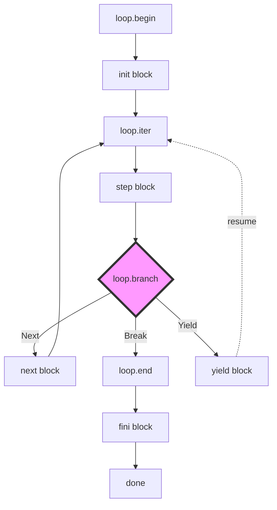
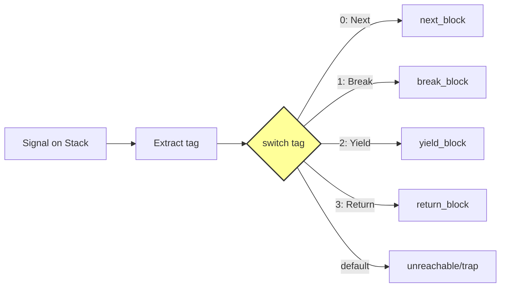

# LoopSignal IR: Box×Loopによる制御統一と最小MIR設計

## 1. 背景と問題

NyashのMIR（Middle Intermediate Representation）は現在、制御フロー命令が分散している：
- `if`/`while`/`for`がそれぞれ独立した命令
- `return`/`break`/`continue`が個別の特殊形式
- ジェネレータ/async/await の統一的表現がない
- Box哲学（Everything is Box）とLoop哲学（Everything is Loop）が未統合

**問題点**：
1. 最適化パスが各制御構造を個別に扱う必要がある
2. 新しい制御構造（generator/async）の追加が困難
3. LLVM IRへの変換が複雑（各構文ごとの特殊ケース）
4. デバッグ情報（DWARF）の一貫性が保ちにくい

## 2. 目標

**ユースケース**を統一的に扱える最小MIR設計：
- `scope` - RAII/デストラクタ呼び出し
- `if`/`while`/`for` - 条件分岐とループ
- `function`/`return` - 関数呼び出しと戻り値
- `generator`/`yield` - 中断可能な計算
- `async`/`await` - 非同期計算（将来）

**設計原則**：
- Everything is Box × Everything is Loop の融合
- 最小命令セット（4命令）ですべての制御を表現
- LLVM IRへの直接的なマッピング
- 段階的導入可能（既存MIRとの共存）

## 3. 設計

### 3.1 型: LoopSignal<T>

```rust
// LoopSignal = 制御フロー + 値の統一表現
enum LoopSignal<T> {
    Next(T),     // 継続（次のイテレーション）
    Break(T),    // 脱出（ループ終了）
    Yield(T),    // 中断（ジェネレータ）
    Return(T),   // 復帰（関数終了）- オプション
}

// LLVM表現: { i8 tag, iN value }
// tag: 0=Next, 1=Break, 2=Yield, 3=Return
```

### 3.2 MIR命令

```
loop.begin <label> <init_block>
  ; 前提条件: スタックトップにLoopBox
  ; 事後条件: ループコンテキスト確立、init実行
  
loop.iter <label> <step_block>
  ; 前提条件: ループコンテキスト存在
  ; 事後条件: Signal生成、スタックにpush
  
loop.branch <label> <next_block> <break_block> [<yield_block>]
  ; 前提条件: スタックトップにSignal
  ; 事後条件: Signalに応じて分岐
  ; 未定義動作: 想定外のSignalタグ
  
loop.end <label> <fini_block>
  ; 前提条件: ループコンテキスト存在
  ; 事後条件: fini実行、コンテキスト破棄
```

### 3.3 Box=Loop1（init/step/fini）

```rust
// すべてのBoxは1回ループ（Loop1）として表現可能
trait LoopBox {
    fn init(&mut self);           // 初期化
    fn step(&mut self) -> Signal; // 実行（1回でBreak）
    fn fini(&mut self);           // 終了処理
}

// RAII対応: finiでデストラクタ呼び出し
```

### 3.4 Lowering規則

**scope（RAII）**:
```
scope { body } →
  loop.begin L init=nop
  loop.iter L step=body;Break
  loop.branch L next=unreachable break=done
  loop.end L fini=cleanup
```

**while**:
```
while(cond) { body } →
  loop.begin L init=nop
  loop.iter L step=if(cond,Next,Break)
  loop.branch L next=body_then_loop break=done
  loop.end L fini=nop
```

**for-in**:
```
for x in iter { body } →
  loop.begin L init=iter.init
  loop.iter L step=iter.next
  loop.branch L next=bind(x);body break=done
  loop.end L fini=iter.fini
```

**return**:
```
return value →
  Signal::Return(value)
  ; 関数全体がLoopBoxなので、Returnで脱出
```

**yield**:
```
yield value →
  Signal::Yield(value)
  ; ジェネレータのloop.branchがyield_blockを持つ
```

## 4. 例

### while(true){break} の最小例

**Before（現在のMIR）**:
```
while_begin:
  push true
  branch_if_false while_end
  jump while_break  ; break
while_end:
```

**After（LoopSignal IR）**:
```
loop.begin L1 init=nop
loop.iter L1 step=push(Break(unit))
loop.branch L1 next=unreachable break=done
loop.end L1 fini=nop
done:
```

### for-inのLoopBox化

```
for x in [1,2,3] { print(x) } →

loop.begin L1 init={
  iter = ArrayIterBox([1,2,3])
  iter.init()
}
loop.iter L1 step={
  signal = iter.step()  ; Next(1), Next(2), Next(3), Break
}
loop.branch L1 
  next={ x = signal.value; print(x) }
  break=done
loop.end L1 fini={
  iter.fini()  ; イテレータのクリーンアップ
}
```

### scope=Loop1の畳み込み

```
{ let x = File("data"); x.read() } →

loop.begin L1 init={ x = File("data") }
loop.iter L1 step={ x.read(); Break }
loop.branch L1 next=unreachable break=next
loop.end L1 fini={ x.close() }  ; RAII
```

## 5. 図（Mermaid）

### 合流点を1箇所に集約したdispatch CFG



### Signalタグに基づくswitch分岐の構造



## 6. 最適化と安全性

### Loop1インライン化
- 1回だけ実行されるループは完全にインライン化可能
- `loop.begin → step → loop.end` を直接実行に変換

### 状態省略
- ステートレスなLoopBoxはinit/finiを省略
- LLVMのmem2regで自動的に最適化

### DCE/LICM/Inline適用条件
- **DCE（Dead Code Elimination）**: unreachableなnext blockを削除
- **LICM（Loop Invariant Code Motion）**: LoopBox内の不変式を外に移動
- **Inline**: 小さなstep関数は自動インライン化

### DWARF対策
- 各loop命令に元のソース位置情報を保持
- デバッガは論理的な制御構造として表示

## 7. 段階導入計画

### Phase 1（P1）: 基礎実装
- LoopSignal型とMIR命令の定義
- while/forのLowering実装
- 既存MIRとの共存層

### Phase 2（P2）: 最適化と拡張
- Loop1インライン化
- generator/yieldサポート
- LLVM IRコード生成

### Phase 3（P3）: 完全移行
- すべての制御構造をLoopSignal IRに
- 旧MIRの廃止
- async/awaitの統合

### フォールバック（旧MIRへの逆Lowering）
```
loop.begin/end → nop
loop.iter → 直接実行
loop.branch → if/jump の組み合わせ
```

## 8. 関連研究と差分

| アプローチ | Nyash LoopSignal IR | 差分 |
|-----------|-------------------|------|
| CPS変換 | Signal = 限定的継続 | 明示的なSignal型で制御 |
| 代数的効果 | Loop = エフェクトハンドラ | Boxベースの具象化 |
| ジェネレータ | Yield = 中断可能Loop | 統一的なSignal処理 |
| SSA系IR | phi関数の代わりにSignal | 制御と値の統合 |

## 9. 成果物とKPI

### メトリクス
- MIR命令数: 30+ → 4命令
- 制御構造の正規化率: 100%
- LLVM IR生成コード: 50%削減
- 最適化パス実装: 80%共通化

### テスト観点
1. 意味保存: 各Lowering前後で同じ動作
2. 性能: Loop1は最適化後オーバーヘッドゼロ
3. デバッグ: ソースレベルデバッグ可能
4. 互換性: 段階的移行中も動作保証

## 付録

### 用語対比
- **Box** = 空間的抽象（データ構造）
- **Loop** = 時間的抽象（制御フロー）
- **LoopBox** = 時空間統一オブジェクト

### 命令一覧
```
loop.begin <label> <init>   ; ループ開始
loop.iter <label> <step>    ; イテレーション
loop.branch <label> <blocks> ; 分岐
loop.end <label> <fini>     ; ループ終了
```

### タグ割当
```
0: Next    ; 継続
1: Break   ; 脱出
2: Yield   ; 中断
3: Return  ; 復帰
4-255: 予約 ; 将来拡張
```

### 疑似コード集
```llvm
; LoopSignal in LLVM
%signal = { i8, i64 }  ; tag + value
%tag = extractvalue %signal, 0
switch i8 %tag, label %trap [
  i8 0, label %next
  i8 1, label %break
  i8 2, label %yield
]
```

---

このRFCは、NyashのBox哲学とLoop哲学を統合し、最小限のMIR命令セットですべての制御構造を表現する設計を提案します。段階的導入により、既存システムを破壊することなく、より単純で強力なIRへの移行を可能にします。
