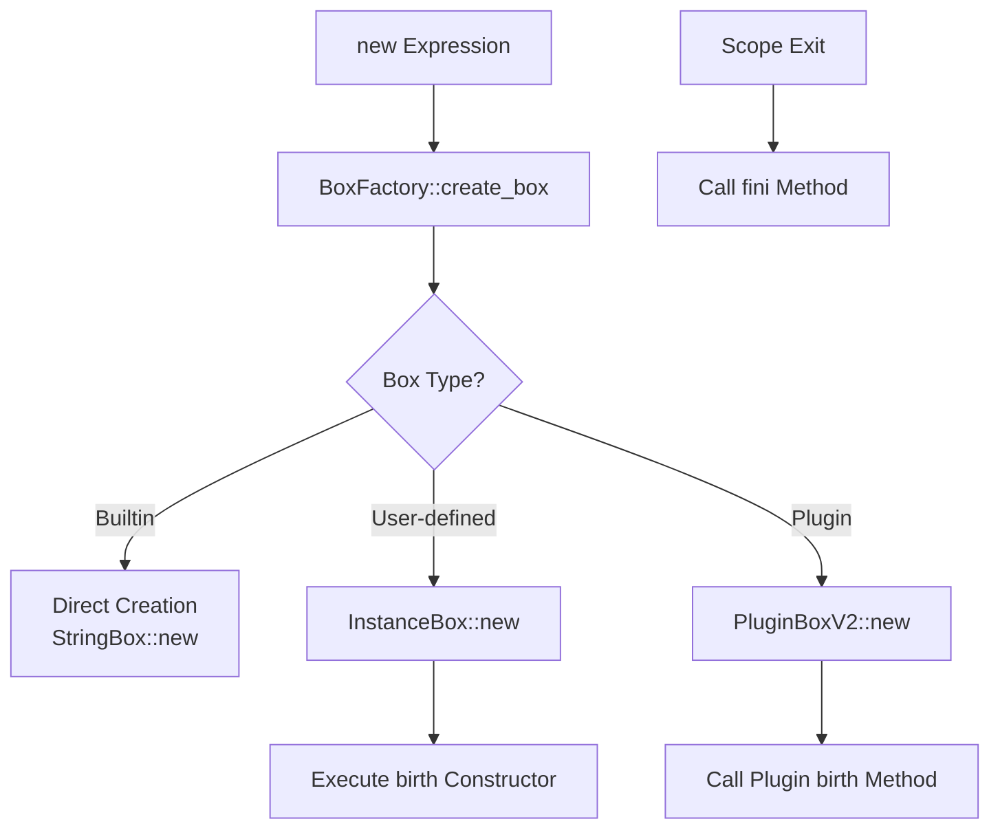
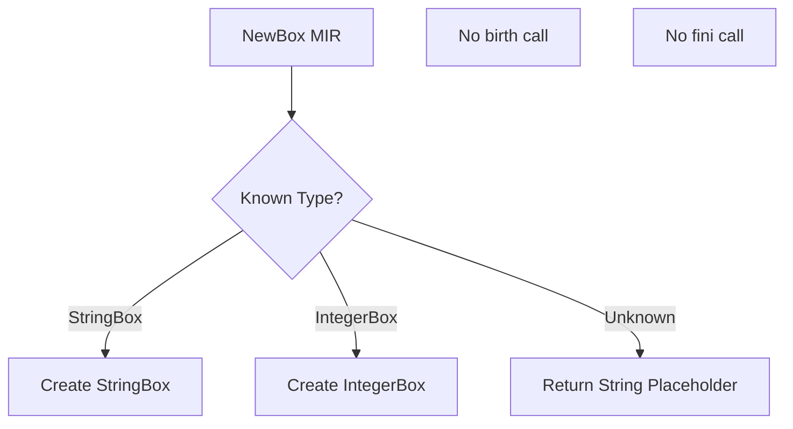

# Phase 9.78a 深層分析: VM統一Box処理の完全設計

## 🚨 **発見された根本的問題**

### 現在のVM実装の問題点

1. **ユーザー定義Boxが未対応**
   ```rust
   // vm.rs NewBox命令
   _ => {
       // For unknown types, create a placeholder string
       VMValue::String(format!("NewBox[{}]", box_type))
   }
   ```

2. **birth/finiライフサイクルが欠落**
   - NewBoxでコンストラクタ呼び出しなし
   - スコープ離脱時のfini呼び出しなし
   - birthメソッドの概念がVMにない

3. **メソッド呼び出しがハードコード**
   ```rust
   fn call_box_method(&self, box_value: Box<dyn NyashBox>, method: &str, _args: Vec<Box<dyn NyashBox>>) {
       // StringBox methods
       if let Some(string_box) = box_value.as_any().downcast_ref::<StringBox>() {
           match method {
               "length" => { ... }
               "toString" => { ... }
               // ハードコードされたメソッドのみ
           }
       }
   }
   ```

## 📊 **インタープリターとVMの実装比較**

### インタープリター（正しい実装）



### VM（不完全な実装）



## 🎯 **統一Box処理の完全設計**

### 1. BoxRegistry統合

```rust
pub struct VM {
    // 既存フィールド
    registers: HashMap<RegisterId, VMValue>,
    
    // 新規追加
    box_factory: Arc<BoxFactory>,      // 統一Box作成
    plugin_loader: Option<Arc<PluginLoaderV2>>,
    scope_tracker: ScopeTracker,       // fini管理
}
```

### 2. 統一NewBox実装

```rust
MirInstruction::NewBox { dst, box_type, args } => {
    // Step 1: 引数を評価してNyashBoxに変換
    let nyash_args: Vec<Box<dyn NyashBox>> = args.iter()
        .map(|id| self.get_value(*id)?.to_nyash_box())
        .collect();
    
    // Step 2: BoxFactory経由で統一作成
    let new_box = self.box_factory.create_box(box_type, &nyash_args)?;
    
    // Step 3: ユーザー定義Boxの場合、birth実行
    if let Some(instance) = new_box.as_any().downcast_ref::<InstanceBox>() {
        // birthコンストラクタを探す
        let birth_key = format!("birth/{}", args.len());
        if let Some(constructor) = self.find_constructor(&instance.class_name, &birth_key) {
            self.execute_constructor(new_box.clone(), constructor, nyash_args)?;
        }
    }
    
    // Step 4: スコープ追跡に登録（fini用）
    let box_id = self.scope_tracker.register_box(new_box.clone());
    
    // Step 5: VMValueに変換して格納
    let vm_value = VMValue::from_nyash_box(new_box);
    self.set_value(*dst, vm_value);
}
```

### 3. 統一メソッド呼び出し

```rust
MirInstruction::BoxCall { dst, box_val, method, args, effects } => {
    let box_vm_value = self.get_value(*box_val)?;
    
    match &box_vm_value {
        // 基本型の最適化パス（高速）
        VMValue::Integer(i) if is_basic_method(method) => {
            self.call_integer_method_optimized(*i, method, args)
        }
        VMValue::String(s) if is_basic_method(method) => {
            self.call_string_method_optimized(s, method, args)
        }
        
        // すべてのBoxを統一的に処理
        _ => {
            let nyash_box = box_vm_value.to_nyash_box();
            let nyash_args = convert_args_to_nyash(args)?;
            
            // メソッドディスパッチ（インタープリターと同じロジック）
            let result = match nyash_box.type_name() {
                // ビルトインBox
                "StringBox" => self.dispatch_string_method(&nyash_box, method, nyash_args)?,
                "IntegerBox" => self.dispatch_integer_method(&nyash_box, method, nyash_args)?,
                
                // プラグインBox
                name if self.plugin_loader.as_ref()
                    .map(|l| l.has_box_type(name)).unwrap_or(false) => {
                    self.dispatch_plugin_method(&nyash_box, method, nyash_args)?
                }
                
                // ユーザー定義Box（InstanceBox）
                _ => {
                    if let Some(instance) = nyash_box.as_any().downcast_ref::<InstanceBox>() {
                        self.dispatch_user_method(instance, method, nyash_args)?
                    } else {
                        return Err(VMError::MethodNotFound { 
                            box_type: nyash_box.type_name().to_string(),
                            method: method.to_string()
                        });
                    }
                }
            };
            
            if let Some(dst_id) = dst {
                self.set_value(*dst_id, VMValue::from_nyash_box(result));
            }
        }
    }
}
```

### 4. スコープ管理とfini呼び出し

```rust
pub struct ScopeTracker {
    scopes: Vec<Scope>,
}

pub struct Scope {
    boxes: Vec<(u64, Arc<dyn NyashBox>)>,  // (id, box)
}

impl VM {
    fn exit_scope(&mut self) -> Result<(), VMError> {
        if let Some(scope) = self.scope_tracker.scopes.pop() {
            // スコープ内のすべてのBoxに対してfiniを呼ぶ
            for (_, box_ref) in scope.boxes.iter().rev() {
                // ユーザー定義Box
                if let Some(instance) = box_ref.as_any().downcast_ref::<InstanceBox>() {
                    if let Some(fini_method) = self.find_method(&instance.class_name, "fini") {
                        self.execute_method(box_ref.clone(), "fini", vec![])?;
                    }
                }
                
                // プラグインBox
                #[cfg(all(feature = "plugins", not(target_arch = "wasm32")))]
                if let Some(plugin) = box_ref.as_any().downcast_ref::<PluginBoxV2>() {
                    plugin.call_fini();
                }
                
                // ビルトインBoxは元々finiなし（将来追加予定）
            }
        }
        Ok(())
    }
}
```

## 🔧 **実装の段階的アプローチ**

### Phase 1: 基盤整備
1. BoxFactory統合
2. ScopeTracker実装
3. VMValue::BoxRef追加

### Phase 2: 統一NewBox
1. BoxFactory経由の作成
2. birthコンストラクタ実行
3. スコープ登録

### Phase 3: 統一BoxCall
1. メソッドディスパッチ統一
2. プラグインメソッド対応
3. ユーザー定義メソッド対応

### Phase 4: ライフサイクル完成
1. スコープ管理実装
2. fini自動呼び出し
3. メモリリーク防止

## 📈 **期待される効果**

1. **完全な統一性**
   - すべてのBox型が同じライフサイクル
   - birth → 使用 → finiの一貫性
   - メソッド呼び出しの統一

2. **パフォーマンス維持**
   - 基本型は最適化パス維持
   - BoxRefによる軽量参照
   - 必要時のみ変換

3. **保守性向上**
   - ハードコード削減
   - 新Box型追加が容易
   - バグの温床排除

## 🚨 **重要な設計原則**

### Everything is Box + 統一ライフサイクル

```nyash
// すべて同じパターン
local str = new StringBox("hello")     // birth
local user = new UserBox("Alice")       // birth  
local file = new FileBox("test.txt")    // birth

// すべて同じメソッド呼び出し
str.length()
user.getName()
file.read()

// スコープ離脱時、すべてfini
// (自動的に呼ばれる)
```

---

**作成日**: 2025-08-21  
**重要度**: 最高（アーキテクチャの根幹）  
**前提**: Phase 9.78 BoxFactory完了